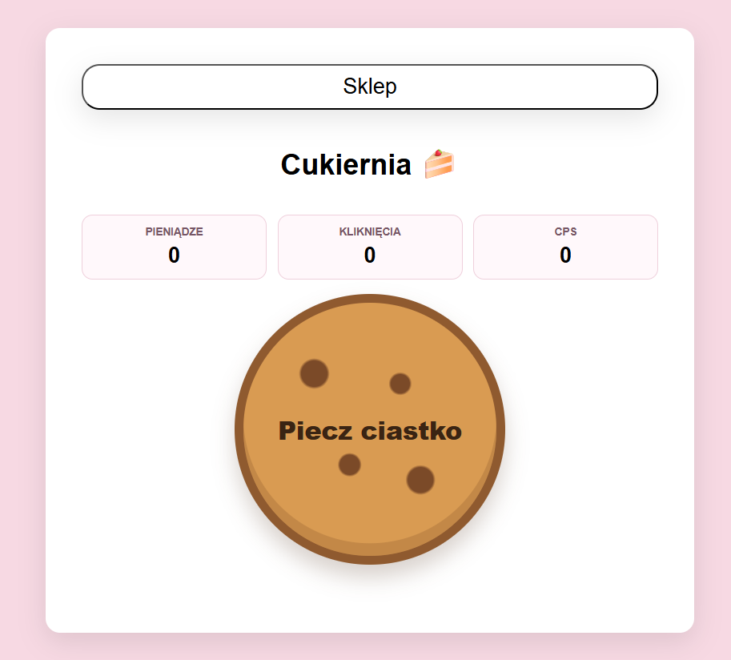
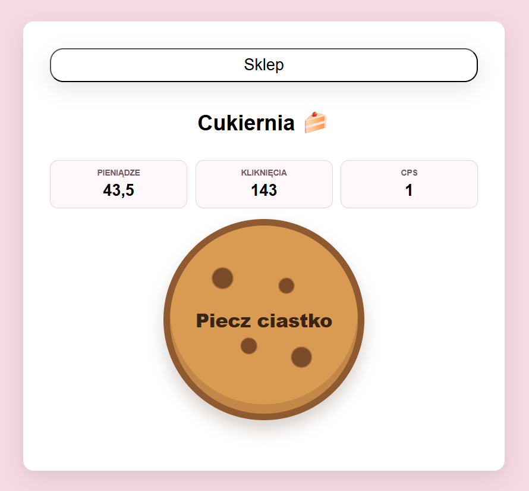
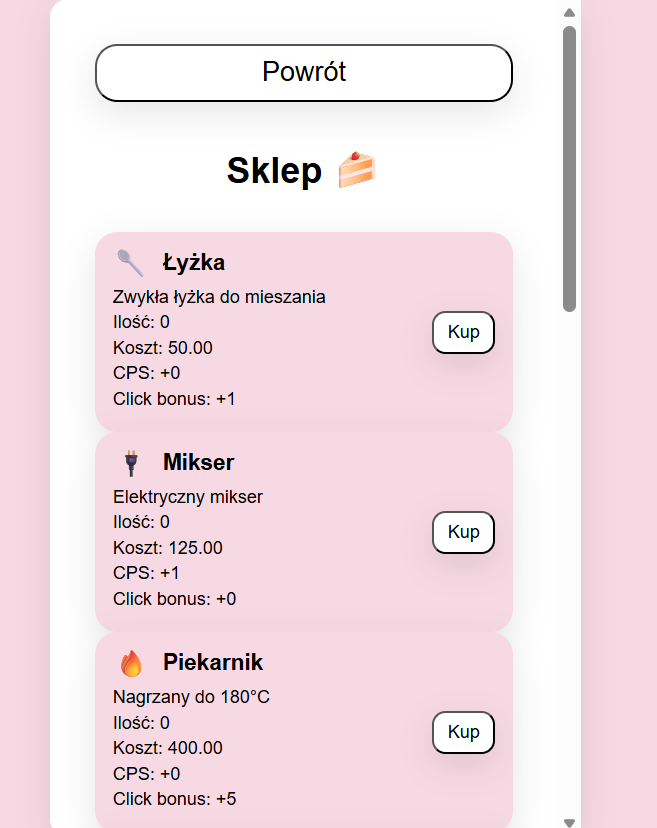
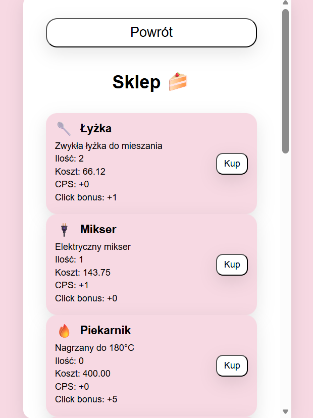
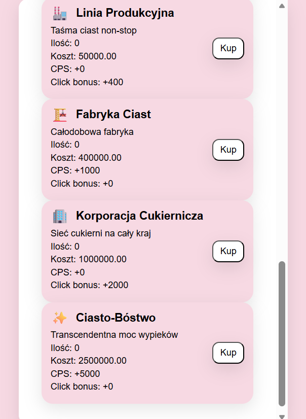

# MINA Cukiernia

Prosta webowa gra typu clicker tworzona w Pythonie.

## Opis projektu

Cukiernia Clicker to lekka gra przeglądarkowa, w której gracz zdobywa punkty przez klikanie, a następnie może kupować ulepszenia zwiększające tempo zdobywania punktów.


## Technologie

Projekt wykorzystuje:

- Python 3.12,
- FastAPI,
- Uvicorn,
- uv,
- pytest,
- httpx.

## Instalacja

Najpierw zainstaluj `uv`.

Windows PowerShell:

```powershell
powershell -ExecutionPolicy ByPass -c "irm https://astral.sh/uv/install.ps1 | iex"
```

Sprawdź instalację:

```bash
uv --version
```

Następnie sklonuj repozytorium:

```bash
git clone ADRES_REPOZYTORIUM
cd MINA_CUKIERNIA
```

Zainstaluj zależności:

```bash
uv sync
```

## Uruchomienie projektu

```bash
uv run uvicorn backend.main:app --reload
```

Aplikacja będzie dostępna pod adresem:

```text
http://127.0.0.1:8000
```

## Uruchomienie testów

```bash
uv run pytest
```

Poprawny wynik testów powinien wyglądać mniej więcej tak:

```text
1 passed
```

## Struktura projektu

```text
MINA_CUKIERNIA/
├── .github/
│   └── workflows/
│       └── pre-commit.yml
│
├── backend/
│   └── main.py
│   └── api/
│       └── endpoints/
│   └── db/
│   └── models/
│   └── schemas/
│   └── services/
│   └── utils/
│
├── frontend/
│   └── assets/
│   └── index.html
│   └── app.js
│   └── style.css
│
├── tests/
│
├── pyproject.toml
├── uv.lock
├── .python-version
├── .pre-commit-config.yaml
├── .gitignore
├── README.md
└── CONTRIBUTIONS.md
```

## Przydatne komendy

Instalacja zależności:

```bash
uv sync
```

Dodanie nowej biblioteki:

```bash
uv add nazwa_biblioteki
```

Dodanie biblioteki developerskiej:

```bash
uv add --dev nazwa_biblioteki
```

Uruchomienie aplikacji:

```bash
uv run uvicorn main:app --reload
```

Uruchomienie testów:

```bash
uv run pytest
```
## Pre-commit i kontrola jakości kodu

Projekt wykorzystuje `pre-commit` oraz `ruff` do automatycznej kontroli jakości kodu.

Hooki uruchamiają się automatycznie przed każdym commitem i sprawdzają między innymi:

- formatowanie kodu,
- błędy składni,
- trailing whitespace,
- poprawne zakończenia plików,
- podstawowe problemy wykrywane przez `ruff`.

## Instalacja hooków

Jednorazowo po sklonowaniu repozytorium należy wykonać:

```bash
uv sync
```

Następnie zainstalować hooki:

```bash
uv run pre-commit install
```

## Ręczne uruchomienie pre-commit

Sprawdzenie wszystkich plików:

```bash
uv run pre-commit run --all-files
```

## Ruff

Sprawdzenie jakości kodu:

```bash
uv run ruff check .
```

Automatyczne formatowanie kodu:

```bash
uv run ruff format .
```

## GitHub Actions

Repozytorium wykorzystuje GitHub Actions do automatycznego sprawdzania projektu po:

- pushu na branch `main`,
- utworzeniu Pull Requesta.

Pipeline wykonuje:

- instalację zależności przez `uv`,
- uruchomienie `pre-commit`,
- sprawdzenie jakości kodu,
- testy projektu.

Dzięki temu łatwiej utrzymać jednolity styl kodu i uniknąć błędów przed mergem zmian.

## Zrzuty ekranu

### Start gry



### Gra w trakcie



### Sklep — start



### Sklep — po zakupach



### Końcowe produkty



## Dokumentacja

- [Architektura](docs/architecture.md) — warstwy aplikacji, struktura katalogów, model danych, przepływ żądania
- [Endpointy API](docs/endpoints.md) — lista wszystkich endpointów z opisami, schematami i przykładami curl


## Autorzy
