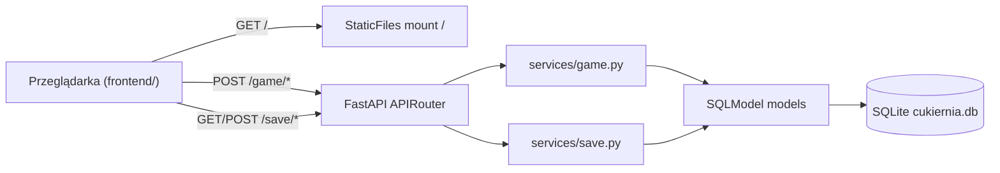
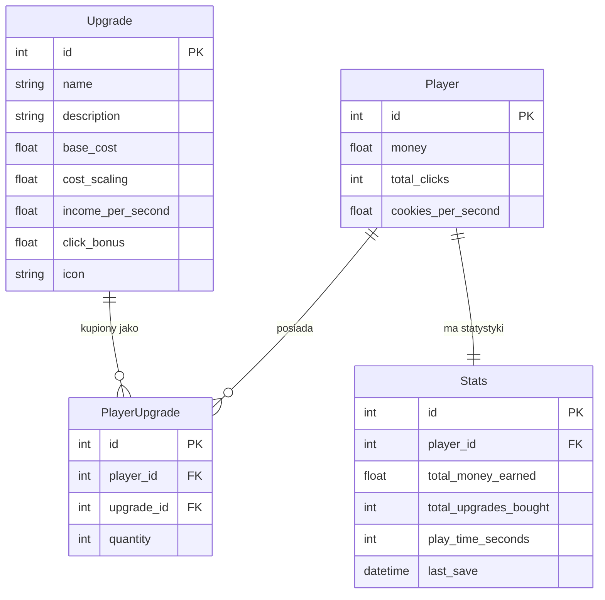

# Architektura projektu

## Stos technologiczny

| Warstwa         | Technologia                    |
|-----------------|--------------------------------|
| Backend         | FastAPI + Uvicorn              |
| ORM / modele    | SQLModel (SQLAlchemy + Pydantic) |
| Baza danych     | SQLite (`cukiernia.db`)        |
| Frontend        | HTML + vanilla JavaScript + CSS |
| Zarządzanie env | uv                             |
| Testy           | pytest + httpx                 |
| Jakość kodu     | ruff, pre-commit               |

## Diagram warstw



## Struktura katalogów

```text
MINA_Cukiernia/
├── backend/
│   ├── main.py                   # Punkt wejścia FastAPI, lifespan, CORS, mount statyk
│   ├── api/
│   │   ├── router.py             # Główny router łączący game + save
│   │   └── enpoints/
│   │       ├── game.py           # Kontrolery: click, tick, buy, upgrades
│   │       └── save.py           # Kontrolery: read/save/reset/stats
│   ├── services/
│   │   ├── game.py               # Logika gry: klik, tick, zakup, CPS
│   │   └── save.py               # Logika zapisu: odczyt, zapis, reset
│   ├── models/
│   │   ├── player.py             # Model Player (money, total_clicks, cps)
│   │   ├── upgrade.py            # Model Upgrade (name, base_cost, income, click_bonus)
│   │   ├── player_upgrade.py     # Model PlayerUpgrade (gracz ↔ ulepszenie, quantity)
│   │   └── stats.py              # Model Stats (total_money_earned, play_time, ...)
│   ├── schemas/
│   │   ├── game.py               # Pydantic DTO: ClickOut, TickOut, BuyUpgradeOut, UpgradeOut
│   │   └── save.py               # Pydantic DTO: SaveIn, SaveOut, StatsOut, ResetOut
│   ├── db/
│   │   └── session.py            # Engine SQLite, get_db (dependency), init_db
│   └── utils/
│       └── seed.py               # Dane startowe: 10 ulepszeń (Łyżka → Ciasto-Bóstwo)
├── frontend/
│   ├── index.html                # Główna strona gry (klikacz)
│   ├── app.js                    # Logika klikacza, auto-income, render stanu
│   ├── shop.html                 # Strona sklepu z ulepszeniami
│   ├── shop.js                   # Pobieranie i kupowanie ulepszeń
│   └── style.css                 # Style CSS
├── tests/
│   ├── conftest.py               # Fixtures: in-memory SQLite, TestClient
│   ├── test_index.py             # Test strony głównej
│   └── test_game.py              # Testy endpointów /game/click i /game/buy
├── docs/
│   ├── architecture.md           # Ten plik
│   └── endpoints.md              # Opis endpointów API
├── pyproject.toml
├── uv.lock
└── README.md
```

## Model danych



## Przepływ żądania — kliknięcie ciastka

1. Gracz klika przycisk **"Piecz ciastko"** w `frontend/index.html`.
2. `app.js` → `handleCookieClick()` wysyła `POST /game/click`.
3. FastAPI router kieruje do `backend/api/enpoints/game.py` → `click()`.
4. Endpoint wywołuje `game_service.handle_click(db)`.
5. Serwis pobiera (lub tworzy) gracza przez `get_or_create_player(db)`.
6. Oblicza wartość kliknięcia (`1.0 + bonusy z ulepszeń`).
7. Zwiększa `player.money` i `player.total_clicks`, zapisuje do bazy.
8. Zwraca `ClickOut(money, total_clicks, cookies_per_second)`.
9. Frontend aktualizuje wyświetlane statystyki.

## Mechanika kosztów ulepszeń

Koszt zakupu rośnie wykładniczo:

```
koszt = base_cost × cost_scaling ^ posiadana_ilość
```

Domyślnie `cost_scaling = 1.15`, więc każde kolejne ulepszenie jest o 15% droższe.
